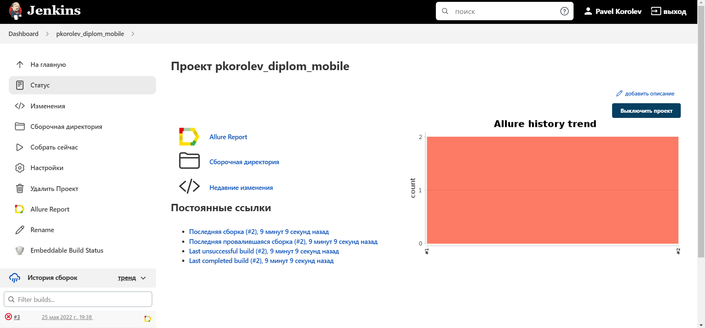
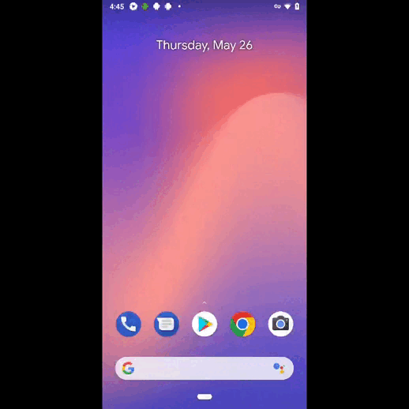

# Это проект с автотестами пользовательского интерфейса для Android-приложения «Википедия» в Browserstack.

## :computer: Технологии и инструменты

## :notebook_with_decorative_cover: Реализованные проверки
- Тест на проверку четырех шагов адаптации
- Тест на проверку работы строки поиска

## :electric_plug: Сборка в Jenkins
### <a target="_blank" href="https://jenkins.autotests.cloud/job/pkorolev_diplom_mobile/">Сборка в Jenkins</a>

  

## :open_book: Allure отчет
- ### Главный экран отчета

### Страница с проведенными тестами

## :robot: Отчет в Telegram

## :film_projector: Видео примеры прохождения тестов
> К каждому тесту в отчете прилагается видео. Одно из таких видео представлено ниже.

  

